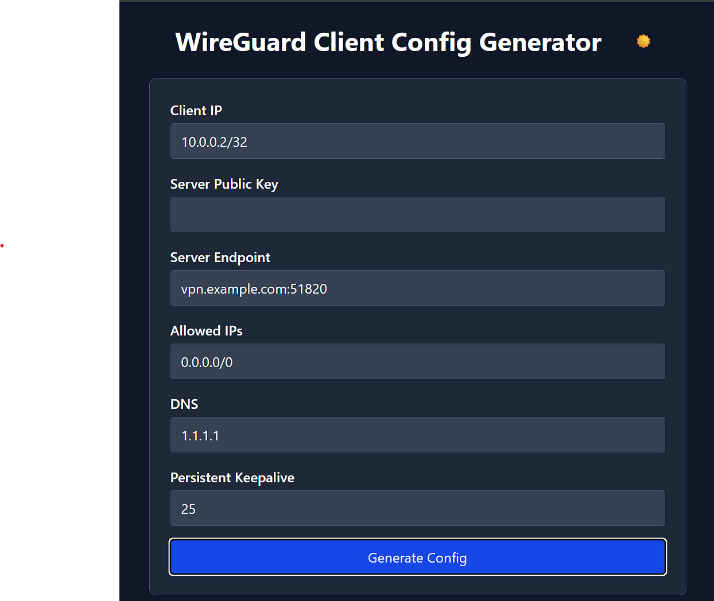

# WireGuard UI Configuration Generator

A React-based web interface for generating WireGuard client configuration files with an intuitive UI and dark/light theme support.



## Features

- Generate WireGuard client configurations with one click
- Automatic key pair generation
- Customizable connection parameters:
  - Client IP address
  - Server public key
  - Server endpoint
  - Allowed IPs
  - DNS servers
  - Persistent keepalive
- Dark/light theme toggle
- Download config files with custom names
- Responsive design

## Installation

1. Clone the repository:
```bash
git clone https://github.com/your-repo/wireguard-ui.git
cd wireguard-ui
```

2. Install dependencies:
```bash
npm install
```

3. Start the development server:
```bash
npm run dev
```

## Usage

1. Fill in the connection parameters
2. Click "Generate Config"
3. Review the generated configuration
4. Click "Download Config" to save the file

The downloaded `.conf` file can be used directly with WireGuard clients.

## Technology Stack

- React 18
- TypeScript
- Vite
- Tailwind CSS
- Framer Motion (for animations)
- TweetNaCl (for cryptographic operations)

## Configuration

The app can be customized by modifying:

- `src/contexts/ThemeContext.tsx` - Theme settings
- `src/pages/WireGuardClientConfig.tsx` - Main configuration UI
- `vite.config.ts` - Build configuration

## Building for Production

```bash
npm run build
```

The production build will be created in the `dist/` directory.

## License

MIT
